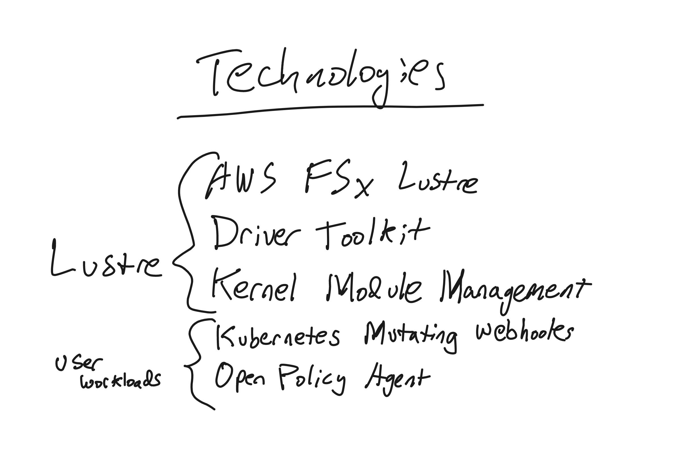
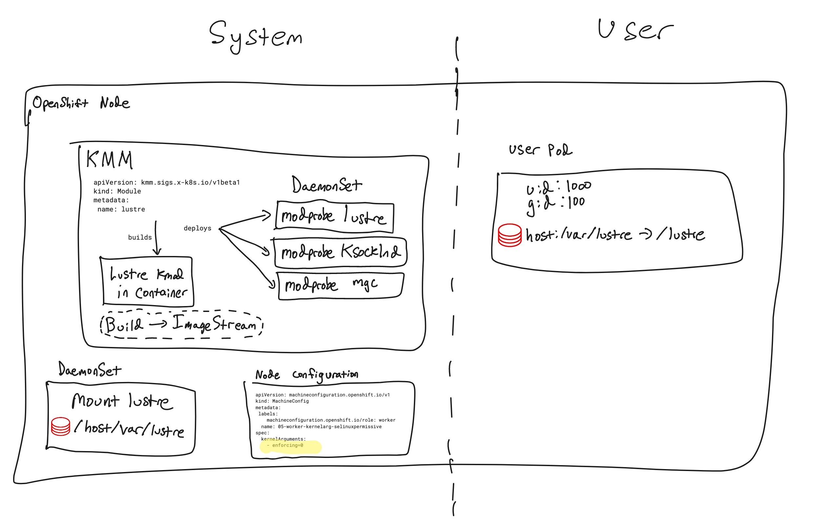
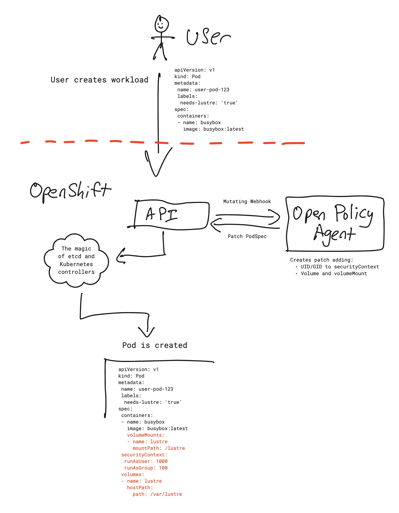

# Lustre on OpenShift

This repository demonstrates how to mount Lustre (specifically AWS FSx Lustre) on OpenShift and utilize it similar to a traditional HPC environment.

## Overview

This solution enables:

- Building Lustre kernel modules for Red Hat CoreOS (RHCOS) workers in OpenShift
- Mounting Lustre filesystems on OpenShift worker nodes
- Dynamically patching user workloads to bind mount Lustre into Pods using Open Policy Agent

## Kernel Module Deployment Approaches

There are two approaches for deploying the Lustre client kernel modules:

### 1. Cluster Layering (Recommended)

Cluster layering integrates the Lustre client kernel modules directly into the RHCOS node image itself. This method:
- Provides better integration with OpenShift's lifecycle management
- Offers improved stability and reliability
- Is the officially recommended approach

**To implement the cluster layering approach, see:** [cluster-layering/](cluster-layering/)

### 2. Kernel Module Management (Alternative)

The KMM operator builds the kernel modules in a container and installs them in the live kernel. While functional, this approach is provided as an alternative when cluster layering cannot be implemented.

**For the alternative KMM approach, see:** [kernel-module-management/](kernel-module-management/)

## Test Lustre mounts on host

```
oc debug -t node/<node> -- chroot /host
mount -t lustre mgs:/path /mnt/lustre
```

If there are issues mounting, the lnet setup may be wonky:

```
dmesg
```
```
[56404.332675] Lustre: Lustre: Build Version: 2.15.7
[56404.387135] LNet: 371570:0:(config.c:1530:lnet_inet_enumerate()) lnet: Ignoring interface ovs-system: it's down
[56404.387317] LNet: Added LNI 10.131.0.2@tcp [8/256/0/180]
[56404.387379] LNet: Accept secure, port 988
```

You may have to force lnet to br-ex interface:

```
echo "options lnet networks=tcp0(br-ex)" >> /etc/modprobe.d/lustre.conf
```

```
lustre_rmmod
modprobe lustre
lnetctl net show
```
```
net:
    - net type: lo
      local NI(s):
        - nid: 0@lo
          status: up
    - net type: tcp
      local NI(s):
        - nid: 10.0.28.18@tcp
          status: up
          interfaces:
              0: br-ex
```

## Mutating Webhooks with Open Policy Agent

To dynamically patch user workloads with the correct UIDs and volume mount information, we use [admission webhooks](https://kubernetes.io/docs/reference/access-authn-authz/extensible-admission-controllers/). This allows us to access and modify each API request as it comes to Kubernetes.

### Deploying Open Policy Agent and MutatingWebhookConfiguration

Open Policy Agent (OPA) is one of several possible approaches for implementing admission webhooks, alongside alternatives like Kyverno or custom webhooks built with Operator-SDK.

#### Safety Considerations

Misconfigured webhooks can severely impact cluster functionality, so we carefully limit the scope:

- We restrict webhook rules to only CREATE operations on namespace-scoped resources:

```
  - operations: ["CREATE"]
    apiGroups: ["*"]
    apiVersions: ["*"]
    resources: ["*"]
    scope: "Namespaced"
```

- We use namespace selectors to apply webhooks only to namespaces with our label: `openpolicyagent.org/webhook=`
- We set `failurePolicy: Fail` to ensure user workloads won't be created if OPA is unavailable (fail-closed approach)

### Installation

Install OPA + kube-mgmt:

```
$ helm repo add opa https://open-policy-agent.github.io/kube-mgmt/charts
$ helm repo update
$ helm inspect values opa/opa-kube-mgmt > values.yaml

$ helm upgrade -i -n opa --create-namespace opa opa/opa-kube-mgmt --values opa/values.yaml
$ oc apply -k opa/
```

OPA uses Rego, a custom policy language (based loosely on datalog/prolog), which we deploy via ConfigMap to enforce our policies.

## Testing the Solution

To test the complete solution, we've included a sample project namespace with the correct annotations for OPA mutation:

```
$ oc apply -k project1/
```

## Architecture Diagrams

### Technologies Involved



### Node View



### Request Flow


